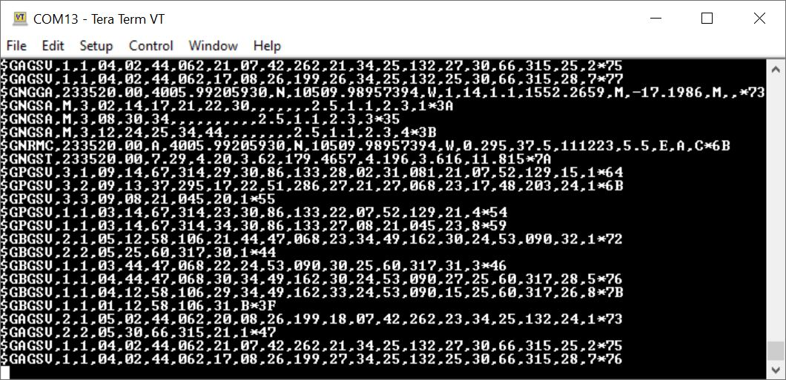
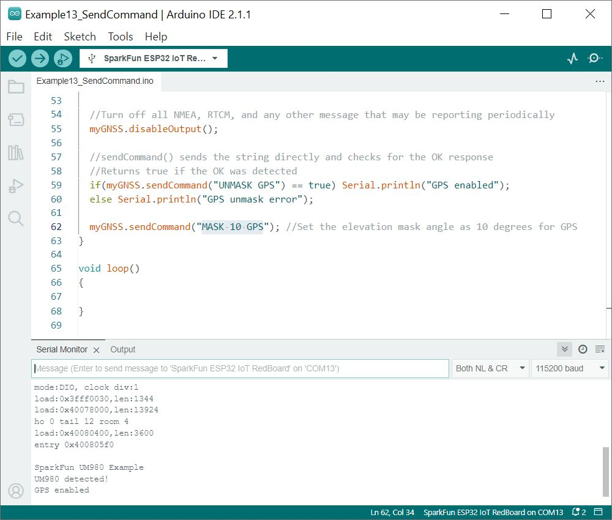

Now that we have our library and board add-on installed, we can get started experimenting with the breakout board. For the scope of this tutorial, we will go over the examples from the Arduino Library. From there, we will be able to build our own custom code to integrate the development board into a project.

### Example 1: Position, Velocity, and Time

In this example, we will query a UM980's UART2 port for its position, velocity, and time data.

From the menu, select the following: **File** > **Examples** > **SparkFun UM980 Triband RTK GNSS Arduino Library** > **Example1_PositionVelocityTime** . If you have not already, select your Board (in this case the **SparkFun ESP32 IoT RedBoard**), and associated COM port. Then hit the upload button. After uploading the code, open the [Serial Monitor](https://learn.sparkfun.com/tutorials/terminal-basics/arduino-serial-monitor-windows-mac-linux) or terminal emulator of your choice with a baud rate set to **115200**.

Give it a moment to check the satellites in view. You will be able to see your position, velocity, date, time, and the number of satellites in view.

  <table>
    <tr style="vertical-align:middle;">
     <td style="text-align: center; vertical-align: middle;"></td>
    </tr>
  </table>

### Example 2: Direct Connect

In this example, characters coming from the UM980's UART2 port are echoed and send characters to the UM980. This allows a user to directly enter command strings into the UM980 while still connected to the Arduino. This is good for viewing the raw output from a given command.

From the menu, select the following: **File** > **Examples** > **SparkFun UM980 Triband RTK GNSS Arduino Library** > **Example2_DirectConnect** . If you have not already, select your Board (in this case the **SparkFun ESP32 IoT RedBoard**), and associated COM port. Then hit the upload button. After uploading the code, open the [Serial Monitor](https://learn.sparkfun.com/tutorials/terminal-basics/arduino-serial-monitor-windows-mac-linux) or terminal emulator of your choice with a baud rate set to **115200**. For this example, make sure to have **both NL & *CR** turned on.

Type <kbd>CONFIG</kbd> and send the command through the serial terminal. You should receive a response with the current UM980 configuration. Make sure to check out the UM980's Reference Commands Manual linked in the [Resources for more commands](../resources).

  <table>
    <tr style="vertical-align:middle;">
     <td style="text-align: center; vertical-align: middle;"></td>
    </tr>
  </table>

### Example 3: ECEF and Stats

This example will query the UM980's UART2 port for the signal quality and fix type.

From the menu, select the following: **File** > **Examples** > **SparkFun UM980 Triband RTK GNSS Arduino Library** > **Example3_ECEFandStats** . If you have not already, select your Board (in this case the **SparkFun ESP32 IoT RedBoard**), and associated COM port. Then hit the upload button. After uploading the code, open the [Serial Monitor](https://learn.sparkfun.com/tutorials/terminal-basics/arduino-serial-monitor-windows-mac-linux) or terminal emulator of your choice with a baud rate set to **115200**.

The output will be similar to example 1 with additional information.

  <table>
    <tr style="vertical-align:middle;">
     <td style="text-align: center; vertical-align: middle;"></td>
    </tr>
  </table>

### Example 4: Enable NMEA at 5Hz

This example shows how to enable various NMEA sentences at different rates on different ports at 5Hz.

From the menu, select the following: **File** > **Examples** > **SparkFun UM980 Triband RTK GNSS Arduino Library** > **Example4_EnableNMEA_5Hz** .  If you have not already, select your Board (in this case the **SparkFun ESP32 IoT RedBoard**), and associated COM port. Then hit the upload button. After uploading the code, open the [Serial Monitor](https://learn.sparkfun.com/tutorials/terminal-basics/arduino-serial-monitor-windows-mac-linux) or terminal emulator of your choice with a baud rate set to **115200**.

The output will begin outputting NEMA sentences.

  <table>
    <tr style="vertical-align:middle;">
     <td style="text-align: center; vertical-align: middle;"></td>
    </tr>
  </table>

### Example 5: Enable RTCM

This example shows how to configure the UM980 into base mode using specified coordinates.

From the menu, select the following: **File** > **Examples** > **SparkFun UM980 Triband RTK GNSS Arduino Library** > **Example5_EnableRTCM** .  If you have not already, select your Board (in this case the **SparkFun ESP32 IoT RedBoard**), and associated COM port. Then hit the upload button. After uploading the code, open the [Serial Monitor](https://learn.sparkfun.com/tutorials/terminal-basics/arduino-serial-monitor-windows-mac-linux) or terminal emulator of your choice with a baud rate set to **115200**.

Once open, the example will begin outputting the RTCM data. The Serial Terminal will output random characters due to the RTCM being in binary. This data will be interpreted by other high precision RTK GNSS modules.

  <table>
    <tr style="vertical-align:middle;">
     <td style="text-align: center; vertical-align: middle;"></td>
    </tr>
  </table>

### Example 6: Average Base

This example shows how to put the UM980 into a Base mode configuration using the average of positional fixes obtained over a 60 second period. We also turn on RTCM messages.

From the menu, select the following: **File** > **Examples** > **SparkFun UM980 Triband RTK GNSS Arduino Library** > **Example6_AverageBase** .  If you have not already, select your Board (in this case the **SparkFun ESP32 IoT RedBoard**), and associated COM port. Then hit the upload button. After uploading the code, open the [Serial Monitor](https://learn.sparkfun.com/tutorials/terminal-basics/arduino-serial-monitor-windows-mac-linux) or terminal emulator of your choice with a baud rate set to **115200**.

Once open, the example will begin outputting certain NMEA sentences and RTCM messages.

  <table>
    <tr style="vertical-align:middle;">
     <td style="text-align: center; vertical-align: middle;"></td>
    </tr>
  </table>

### Example 7: Fixed Base

This example shows how to put the UM980 into a Base mode configuration using specified coordinates.

From the menu, select the following: **File** > **Examples** > **SparkFun UM980 Triband RTK GNSS Arduino Library** > **Example7_FixedBase** .  If you have not already, select your Board (in this case the **SparkFun ESP32 IoT RedBoard**), and associated COM port. Then hit the upload button. After uploading the code, open the [Serial Monitor](https://learn.sparkfun.com/tutorials/terminal-basics/arduino-serial-monitor-windows-mac-linux) or terminal emulator of your choice with a baud rate set to **115200**.

Once open, the example will begin outputting certain NMEA sentences and RTCM messages.

  <table>
    <tr style="vertical-align:middle;">
     <td style="text-align: center; vertical-align: middle;"></td>
    </tr>
  </table>

### Example 8: Set Constellations

This example enables/disables various constellations to be included in position calculations for GPS, GLO, BDS, GAL, and QZSS.

From the menu, select the following: **File** > **Examples** > **SparkFun UM980 Triband RTK GNSS Arduino Library** > **Example8_SetConstellations** .  If you have not already, select your Board (in this case the **SparkFun ESP32 IoT RedBoard**), and associated COM port. Then hit the upload button. After uploading the code, open the [Serial Monitor](https://learn.sparkfun.com/tutorials/terminal-basics/arduino-serial-monitor-windows-mac-linux) or terminal emulator of your choice with a baud rate set to **115200**.

Once open, the output will respond with a message indicating if the GPS was enabled and the configuration is complete.

  <table>
    <tr style="vertical-align:middle;">
     <td style="text-align: center; vertical-align: middle;"></td>
    </tr>
  </table>

### Example 9: Signal Elevation

This example shows how set the Elevation Angle and minimum CN0 value required from a satellite to be included in the position calculation.

From the menu, select the following: **File** > **Examples** > **SparkFun UM980 Triband RTK GNSS Arduino Library** > **Example9_SignalEleveation** .  If you have not already, select your Board (in this case the **SparkFun ESP32 IoT RedBoard**), and associated COM port. Then hit the upload button. After uploading the code, open the [Serial Monitor](https://learn.sparkfun.com/tutorials/terminal-basics/arduino-serial-monitor-windows-mac-linux) or terminal emulator of your choice with a baud rate set to **115200**.

Once open, the output will notify you when the UM980 is configured.

  <table>
    <tr style="vertical-align:middle;">
     <td style="text-align: center; vertical-align: middle;"></td>
    </tr>
  </table>

### Example 10: Set Rover Mode

This example shows how set the station mode to Survey, UAV, or Automotive.

From the menu, select the following: **File** > **Examples** > **SparkFun UM980 Triband RTK GNSS Arduino Library** > **Example10_SetRoverMode**.  If you have not already, select your Board (in this case the **SparkFun ESP32 IoT RedBoard**), and associated COM port. Then hit the upload button. After uploading the code, open the [Serial Monitor](https://learn.sparkfun.com/tutorials/terminal-basics/arduino-serial-monitor-windows-mac-linux) or terminal emulator of your choice with a baud rate set to **115200**.

Once open, the output will notify you when the UM980 is configured. If you need to configure the device for a different mode, you will just need to use a [single line comment (`//`)](https://www.arduino.cc/reference/en/language/structure/further-syntax/singlelinecomment/) to adjust the code.

  <table>
    <tr style="vertical-align:middle;">
     <td style="text-align: center; vertical-align: middle;"></td>
    </tr>
  </table>

### Example 11: USB NMEA

This sketch turns on all the major NMEA sentences at 2Hz and prints the incoming serial out to the Serial port. This is useful for viewing the GNSS data in a program like u-center (u-blox's software) or UPrecise (Unicore's software).

From the menu, select the following: **File** > **Examples** > **SparkFun UM980 Triband RTK GNSS Arduino Library** > **Example11_UsbNMEA** .  If you have not already, select your Board (in this case the **SparkFun ESP32 IoT RedBoard**), and associated COM port. Then hit the upload button. After uploading the code, open the [Serial Monitor](https://learn.sparkfun.com/tutorials/terminal-basics/arduino-serial-monitor-windows-mac-linux) or terminal emulator of your choice with a baud rate set to **115200**.

Once open, the output will notify you when the UM980 is configured.

  <table>
    <tr style="vertical-align:middle;">
     <td style="text-align: center; vertical-align: middle;"></td>
    </tr>
  </table>

Disconnect the UM980 from the IoT RedBoard - ESP32. Then disconnect the USB cable from the IoT RedBoard - ESP32. Connect the USB cable between the UM980 and your computer. Open a terminal emulator set at **115200** baud. Once connected, you should begin seeing NMEA sentences through the USB port.

  <table>
    <tr style="vertical-align:middle;">
     <td style="text-align: center; vertical-align: middle;"></td>
    </tr>
  </table>

Of course, you can also view the data through a GUI such as the u-center (u-blox's software) or UPrecise (Unicore's software) as well.

### Example 12: Factory Reset

This example shows how set the UM980 back to factory defaults.

From the menu, select the following: **File** > **Examples** > **SparkFun UM980 Triband RTK GNSS Arduino Library** > **Example12_FactoryReset** .  If you have not already, select your Board (in this case the **SparkFun ESP32 IoT RedBoard**), and associated COM port. Then hit the upload button. After uploading the code, open the [Serial Monitor](https://learn.sparkfun.com/tutorials/terminal-basics/arduino-serial-monitor-windows-mac-linux) or terminal emulator of your choice with a baud rate set to **115200**.

Once open, the output will notify you when the UM980 is ready to be configured. Send a character through the [Serial Monitor](https://learn.sparkfun.com/tutorials/terminal-basics/arduino-serial-monitor-windows-mac-linux) to factory reset the UM980. The code will then begin outputting the position, velocity, date, time, and satellites as shown in example 1. Give it a moment to check the satellites in view before getting valid data.

  <table>
    <tr style="vertical-align:middle;">
     <td style="text-align: center; vertical-align: middle;"></td>
    </tr>
  </table>

### Example 13: Send Command

While the SparkFun UM980 Arduino library covers most of the features in the UM980, there may be a special command that is needed but not supported. This sketch shows how to send commands directly to the UM980.

From the menu, select the following: **File** > **Examples** > **SparkFun UM980 Triband RTK GNSS Arduino Library** > **Example13_SendCommand* .  If you have not already, select your Board (in this case the **SparkFun ESP32 IoT RedBoard**), and associated COM port. Then hit the upload button. After uploading the code, open the [Serial Monitor](https://learn.sparkfun.com/tutorials/terminal-basics/arduino-serial-monitor-windows-mac-linux) or terminal emulator of your choice with a baud rate set to **115200**.

Once open, there's not too much in the output. Try adjusting the ASCII command within the `myGNSS.sendCommand()` to send a different special command. For more information, try looking at the [Reference Commands Manual in the Resources](../resources).

  <table>
    <tr style="vertical-align:middle;">
     <td style="text-align: center; vertical-align: middle;"></td>
    </tr>
  </table>

### Example 14: Set PPS

The example shows how to configure the PPS signal's width, frequency, and polarity.  

From the menu, select the following: **File** > **Examples** > **SparkFun UM980 Triband RTK GNSS Arduino Library** > **Example14_SetPPS** .  If you have not already, select your Board (in this case the **SparkFun ESP32 IoT RedBoard**), and associated COM port. Then hit the upload button. After uploading the code, open the [Serial Monitor](https://learn.sparkfun.com/tutorials/terminal-basics/arduino-serial-monitor-windows-mac-linux) or terminal emulator of your choice with a baud rate set to **115200**.

Once open, the output just tells you the rate that the PPS is blinking at. If you look at the PPS LED on the UM980, the LED will blink at the rate that was set.

  <table>
    <tr style="vertical-align:middle;">
     <td style="text-align: center; vertical-align: middle;"></td>
    </tr>
  </table>

### Example 15: Query Device

This example shows how to send the 'CONFIG' command to get a clear text response that the user can parse to see which settings are set. In this case, we will get the current configuration, version, mode, and mask from the UM980.

From the menu, select the following: **File** > **Examples** > **SparkFun UM980 Triband RTK GNSS Arduino Library** > **Example15_QueryDevice** .  If you have not already, select your Board (in this case the **SparkFun ESP32 IoT RedBoard**), and associated COM port. Then hit the upload button. After uploading the code, open the [Serial Monitor](https://learn.sparkfun.com/tutorials/terminal-basics/arduino-serial-monitor-windows-mac-linux) or terminal emulator of your choice with a baud rate set to **115200**.

  <table>
    <tr style="vertical-align:middle;">
     <td style="text-align: center; vertical-align: middle;"></td>
    </tr>
  </table>

### Example 16: Poll for Valid RTCM Messages

The documentation for the UM980 does not explicitly state which RTCM messages are supported but by sending the enable command to the module we can insinuate which are supported. This sketch sends the 'RTCMxxxx' command and looks for an OK.

From the menu, select the following: **File** > **Examples** > **SparkFun UM980 Triband RTK GNSS Arduino Library** > **Example15_PollForValidRTCMMessages** .  If you have not already, select your Board (in this case the **SparkFun ESP32 IoT RedBoard**), and associated COM port. Then hit the upload button. After uploading the code, open the [Serial Monitor](https://learn.sparkfun.com/tutorials/terminal-basics/arduino-serial-monitor-windows-mac-linux) or terminal emulator of your choice with a baud rate set to **115200**.

Once open, the output will notify you of the RTCM messages that are supported. As of the writing of this tutorial, there are 55 RTCM messages that are supported!

  <table>
    <tr style="vertical-align:middle;">
     <td style="text-align: center; vertical-align: middle;"></td>
    </tr>
  </table>

