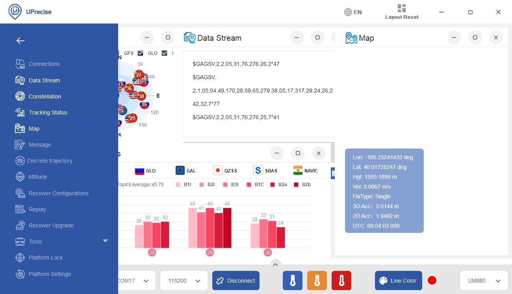
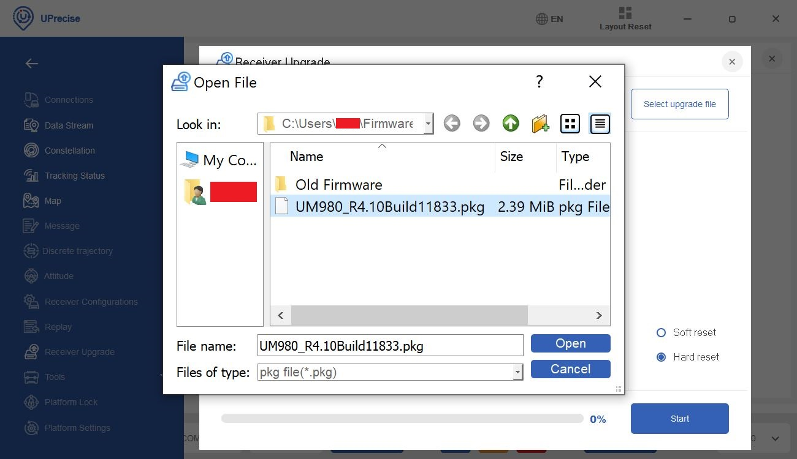

!!! note
     The following instructions were taken from the UPrecise User Manual: 2.2.11 Receiver Upgrade. For more information about how to use UPrecise software, make sure to check out the user manual.

!!! note
    At the time of writing, UPrecise Version 1.0.639 was used. Note that the GUI appearance and features may change upon future releases.

You can update your firmware (they call this a firmware upgrade in the manual) using Unicore's UPrecise software. Make sure to check [Unicore's UM980 product page](https://en.unicorecomm.com/products/detail/26) or [download center](https://en.unicorecomm.com/download) for any firmware releases.

We'll assume that you have the firmware downloaded at this point and connected to the UM980. With UPrecise open, click on the menu with the triple bar (**&equiv;**) near the upper left of the window to expand the menu.

  <table>
    <tr style="vertical-align:middle;">
     <td style="text-align: center; vertical-align: middle;"></td>
    </tr>
  </table>

The menu should expand with text next to each icon.

  <table>
    <tr style="vertical-align:middle;">
     <td style="text-align: center; vertical-align: middle;"></td>
    </tr>
  </table>

Click on the **Receiver Upgrade** button. The following window should open up.

  <table>
    <tr style="vertical-align:middle;">
     <td style="text-align: center; vertical-align: middle;"></td>
    </tr>
  </table>

Click the **Select upgrade file** button. Head to the folder where you downloaded the firmware and select the file. The extension should be a  **&#42;pkg** file.

  <table>
    <tr style="vertical-align:middle;">
     <td style="text-align: center; vertical-align: middle;"></td>
    </tr>
  </table>

<!--

NO OPTION FOR DOUBLE BACKUP...

If necessary, you can select the "Double backup" checkbox. Once the module has finished updating, the main partition makes a backup in the backup partition. If the main partition fails, the module will boot from the backup partition.

  <table>
    <tr style="vertical-align:middle;">
     <td style="text-align: center; vertical-align: middle;"></td>
    </tr>
  </table>

-->

Select the GNSS receiver that will be receiving the firmware update. In this case it was **Receiver1**. While we are at it, select either the "**Soft reset**" or "**Hard reset**". While updating, the module will need to be reset and this selection will determine the reset method. Let's select the "**Soft Reset**" and have Uprecise reset the module.

  <table>
    <tr style="vertical-align:middle;">
     <td style="text-align: center; vertical-align: middle;"></td>
    </tr>
  </table>

When ready, hit the "Start" button!

  <table>
    <tr style="vertical-align:middle;">
     <td style="text-align: center; vertical-align: middle;"></td>
    </tr>
  </table>

!!! warning
    Make sure to pay attention to the progress bar! You'll want to avoid any interruptions while the firmware is updating as this will cause the upgrade to fail.

!!! note
    If you have issues updating the software with the reset method chosen, try exiting the Receiver Upgrade menu by hitting the "x" button. Then disconnect and reconnect the module by selecting the "Connect" button. You will then need to open the **Receiver Upgrade** window again before hitting the "Start" button.

Once the firmware has been updated, you will notice that the progress bar is at 100% and a message indicating that the firmware upgrade is finished. You can exit out of the window by clicking on the "**x**" button.

  <table>
    <tr style="vertical-align:middle;">
     <td style="text-align: center; vertical-align: middle;"></td>
    </tr>
  </table>

Upon exiting, the you can continue viewing the UM980 output through the UPrecise software.

  <table>
    <tr style="vertical-align:middle;">
     <td style="text-align: center; vertical-align: middle;"></td>
    </tr>
  </table>

