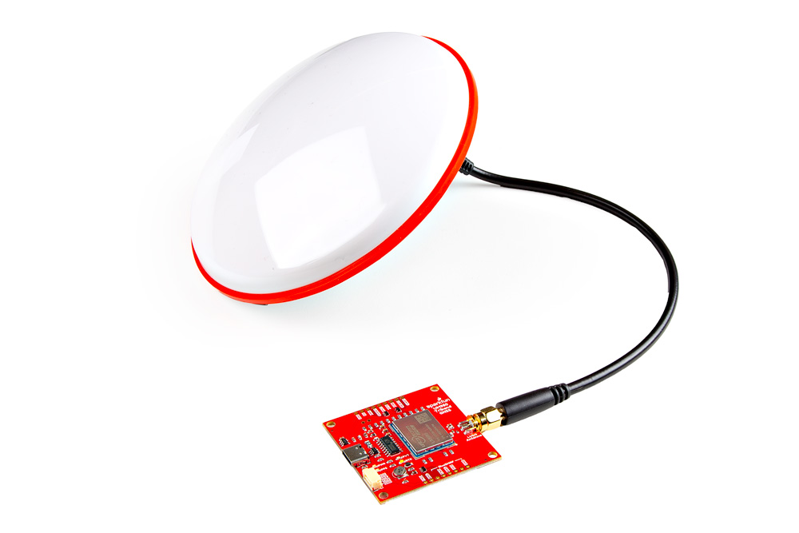

In this section, we'll go over how to connect the Triband GNSS Antenna, GNSS RTK Breakout - UM980, and IoT RedBoard - ESP32 for embedded systems. Of course, you can also connect the UM980 directly to your computer without the need for a microcontroller if you decide to use the UPrecise Software as well.

### L1/L2/L5 Multiband GNSS Antenna

Connect a compatible multi-band antenna that is capable of receiving L1, L2, and L5 bands. In this case, we used the "GNSS Multi-Band L1/L2/L5 Surveying Antenna - TNC (SPK6618H)." This also has a ground plane embedded in the antenna. Insert the TNC side of the interface cable into the antenna's TNC connector. Secure the connection by tightening the screw until it is finger-tight. Then insert the SMA side of the interface cable into the Triband GNSS RTK Breakout's SMA connector. Secure the connection by using the SMA's hex nut until it is finger-tight.

  <table>
    <tr style="vertical-align:middle;">
     <td style="text-align: center; vertical-align: middle;"></td>
    </tr>
  </table>

!!! note
    For users that are using a different multiband antenna, you may need to include a [antenna ground plate](https://www.sparkfun.com/products/17519) to get the most of the multi-band antenna.

!!! note
    Not all multiband antennas are made the same! Make sure that you are connecting a multi-band antenna that is capable of receiving L1/L2/L5 signals when using the Triband GNSS RTK Breakout - UM980.

### Microcontroller

!!! note
    The Arduino Library was written and tested with the ESP32 processor. We recommend using the IoT RedBoard - ESP32 for the scope of this tutorial.

For users using the breakout board in embedded applications, you will need to plug in the JST-GHR-04V Cable to the Triband GNSS RTK Breakout - UM980. You will then need to connect the other end to a microcontroller to process the data. In this case, we used the IoT RedBoard - ESP32.

    <table>
        <tr>
            <th style="text-align: center; border: solid 1px #cccccc;">IoT RedBoard - ESP32
            </th>
            <th style="text-align: center; border: solid 1px #cccccc;"> Triband GNSS RTK Breakout - UM980
            </th>
        </tr>
        <tr>
            <td style="text-align: center; border: solid 1px #cccccc;" bgcolor="#f2dede">3V3
            </td>
            <td style="text-align: center; border: solid 1px #cccccc;" bgcolor="#f2dede">3.3V
            </td>
        </tr>
        <tr>        
            <td style="text-align: center; border: solid 1px #cccccc;" bgcolor="#d4edda">UART1_TX (D4)
            </td>
            <td style="text-align: center; border: solid 1px #cccccc;" bgcolor="#d4edda">RX2
            </td>
        </tr>
        <tr>        
            <td style="text-align: center; border: solid 1px #cccccc;" bgcolor="#ffdaaf">UART1_RX (D13)
            </td>
            <td style="text-align: center; border: solid 1px #cccccc;" bgcolor="#ffdaaf">TX2
            </td>
        </tr>
        <tr>
            <td style="text-align: center; border: solid 1px #cccccc;" bgcolor="#DDDDDD">GND
            </td>
            <td style="text-align: center; border: solid 1px #cccccc;" bgcolor="#DDDDDD">GND
            </td>
        </tr>
    </table>

  <table>
    <tr style="vertical-align:middle;">
     <td style="text-align: center; vertical-align: middle;"></td>
    </tr>
  </table>

### USB to Microcontroller

To power and program the IoT RedBoard - ESP32, users will just need to insert the Type C side of the cable to the development board. The other end will connect to a computer's USB port.

  <table>
    <tr style="vertical-align:middle;">
     <td style="text-align: center; vertical-align: middle;"></td>
    </tr>
  </table>

### USB to Triband GNSS RTK Breakout - UM980

For users that simply want to connect to the board via USB, you will insert a USB C cable into the USB connector. Then connect the other end to your computer USB port.

  <table>
    <tr style="vertical-align:middle;">
     <td style="text-align: center; vertical-align: middle;"></td>
    </tr>
  </table>

### Connecting via PTH

For temporary connections to the PTHs, you could use IC hooks to test out the pins. However, you'll need to solder headers or wires of your choice to the board for a secure connection. You can choose between a combination of [header pins and jumper wires](https://learn.sparkfun.com/tutorials/how-to-solder-through-hole-soldering/all), or [stripping wire and soldering the wire](https://learn.sparkfun.com/tutorials/working-with-wire/all) directly to the board.

-   <a href="https://learn.sparkfun.com/tutorials/how-to-solder-through-hole-soldering/all">
      <figure markdown>
        
      </figure>
    </a>

    ---

    <a href="https://learn.sparkfun.com/tutorials/how-to-solder-through-hole-soldering/all">
      <b>How to Solder: Through Hole Soldering</b>
    </a>
<!-- ----------WHITE SPACE BETWEEN GRID CARDS---------- -->

-   <a href="https://learn.sparkfun.com/tutorials/working-with-wire/all">
      <figure markdown>
        
      </figure>
    </a>

    ---

    <a href="https://learn.sparkfun.com/tutorials/working-with-wire/all">
      <b>Working with Wire</b>
    </a>
<!-- ----------WHITE SPACE BETWEEN GRID CARDS---------- -->

