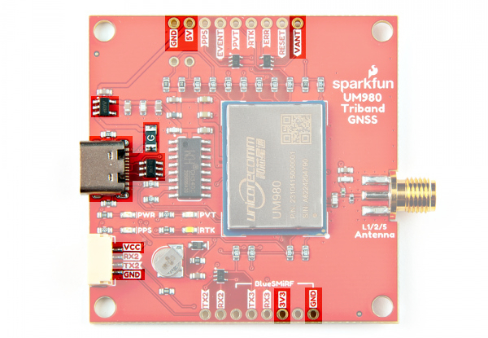

In this section, we will highlight the hardware and pins that are broken out on the SparkFun Triband GNSS RTK Breakout - UM980. For more information, check out our [Resources and Going Further](../resources/) for the UM980.

  <table>
    <tr style="vertical-align:middle;">
     <td style="text-align: center; vertical-align: middle;"></td>
     <td style="text-align: center; vertical-align: middle;"></td>
    </tr>
    <tr style="vertical-align:middle;">
     <td align="center">Top View</td>
     <td align="center">Bottom View</td>
    </tr>
  </table>

### UM980 Module

The board breaks out the UM980 which is an all-constellation, all-frequency, high precision RTK positioning module. This module has a low power consumption of about ~480mW.

  <table>
    <tr style="vertical-align:middle;">
     <td style="text-align: center; vertical-align: middle;"></td>
    </tr>
  </table>

The UM980 is a 1408-Channel GNSS Receiver based on the Nebulas IV&trade; that is able to simultaneously track multiple constellation for L1, L2, and L5 bands.

* Concurrent reception of GPS, GLONASS, Galileo, BeiDou, QZSS
    * GPS: L1C/A, L1C*, L2P(Y), L2C, L5
    * GLONASS: L1, L2
    * Galileo: E1, E5a, E5b, E6*
    * Beidou: B1I, B2I, B3I, B1C, B2a, B2b*
    * QZSS: L1/L2/L5
    * SBAS  

*: Items marked with * are only supported by specific firmware.

  <table>
    <tr style="vertical-align:middle;">
     <td style="text-align: center; vertical-align: middle;"></td>
    </tr>
    <tr style="vertical-align:middle;">
     <td style="text-align: center; vertical-align: middle;">Image Courtesy of <a href="https://www.everythingrf.com/community/navigating-the-l1-l2-and-l5-band-options-for-gnss">everythingRF</a></td>
    </tr>
  </table>

When a RTK solution is reached, the module can achieve a horizontal accuracy of about 8mm (~0.3 inches) and vertical accuracy of 15mm (~0.59 inches). The UM980 is capable of both rover and base station operations. Below are a few specs taken from the datasheet. For more information, check out the related [documents for the UM980 in the Resources](../resources/).

* Horizontal Accuracy
    * Autonomous: 1.5m
    * DGPS: 0.4m
    * RTK: 0.8cm + 1ppm
* Vertical Accuracy
    * Autonomous: 2.5m
    * DGPS: 0.8m
    * RTK: 1.5cm + 1ppm
* 50Hz Data Update Rate*
* Time-To-First-Fix:
    * Cold: 30s
    * Warm: 20s
    * Hot: 5s
* CoCom Limits
    * Max Altitude: 18000m
    * Max G: &lt;5G
    * Max Velocity: 515m/s
* Velocity Accuracy (RMS): 0.03m/s
* Time Accuracy (RMS): 20ns  

*: Items marked with * are only supported by specific firmware.

### Power

There are a variety of power and power-related nets broken out to connectors and through hole pads. Power is regulated down to 3.3V with the AP2122K 3.3V/600mA voltage regulator. The logic levels for the UM980 is 3.3V for the I/O pins.

* **5V** &mdash; Power from the USB C connector's VBUS provides power to the 5V bus. A resettable fuse is connected between the two nets The 5V net is also connected to the edge PTH pin labelled as **5V** and the input of the 3.3V voltage regulator. Care must be taken when connecting to this pin to avoid conflicting voltages between the breakout board and anything connect to the 5V pin. Note that if users cut the default trace on **VSEL** and add solder between the center pad and pad labeled as **5V**, the JST locking connector will provide 5V to any device connected on that port as well.
* **VCC** &mdash; The VCC pin on the JST locking connector provides 3.3V by default to any device that is connected to this port. Users can adjust this voltage by cutting the default trace on the **VSEL** jumper, and adding a solder blob between the center pad and pad labeled as **5V**.
* **3V3** &mdash; The 3V3 pin under the BlueSMiRF provides 3.3V to the any serial device that is connected. If a serial device that is connecting to this port has its own power supply, make sure to cut the trace on the **BT-VCC** jumper on the back to avoid conflicting voltages.
* **VANT** &mdash; The voltage antenna (**VANT**) pin connects to the **VANT** jumper's **EXT** pad. This will provide power to an active antenna on the SMA connector if users cut the default trace on the **VANT** jumper, and add a solder blob between the center pad and pad labeled as **EXT**.
* **GND** &mdash; Of course, is the common, ground voltage (0V reference) for the system.

  <table>
    <tr style="vertical-align:middle;">
     <td style="text-align: center; vertical-align: middle;"></td>
    </tr>
  </table>

### Backup Battery

The small metal disk is a small 3V/1mAh lithium battery. This battery does not provide power to the IC like the 3.3V system does, but to relevant systems inside the IC that allow for a quick reconnection to satellites. The first time to fix (TTFF) is about ~30 seconds. With the backup battery, the warm start is less than 20 seconds and the hot start is less than 5 seconds.

  <table>
    <tr style="vertical-align:middle;">
     <td style="text-align: center; vertical-align: middle;"></td>
    </tr>
  </table>

### CH340 USB-to-Serial Converter

The top side of the board includes a CH340 USB-to-serial converter connected to the serial UART1 port. The chip can be used to send serial data between the device and computer. You can view the output or configure the device through a serial terminal. When using the UM980 with Unicore's UPrecise Software, you can also initiate firmware updates.

  <table>
    <tr style="vertical-align:middle;">
     <td style="text-align: center; vertical-align: middle;"></td>
    </tr>
  </table>

The CH340 driver should automatically install on most operating systems. However, there is a wide range of operating systems out there. You may need to install drivers the first time you connect the chip to your computer's USB port or when there are operating system updates. For more information, check out our [How to Install CH340 Drivers Tutorial](https://learn.sparkfun.com/tutorials/how-to-install-ch340-drivers).

  <table>
    <tr>
      <td style="text-align: center; vertical-align: middle;">
        <a href="https://learn.sparkfun.com/tutorials/how-to-install-ch340-drivers">
          

          

          <h3 style="text-align: left">
            <b>How to Install CH340 Drivers</b>
          </h3>
        </a>
      </td>
    </tr>
  </table>

### Serial UARTs

!!! note
    Current serial UART is only supported on the UM980 module. I2C, SPI, and CAN have been reserved on the module but are not currently supported.

There are three serial UART ports available on the breakout board. Serial UART1 is connected to the CH340 USB-to-serial converter as stated earlier. Serial UART2 is connected to the 4-pin locking JST connector. Tx and Rx are also broken out as PTHs. We recommend using a compatible cable to connect to the locking JST connector to save time connecting to a microcontroller. Serial UART3 is connected to the PTH pins labeled as BlueSMiRF on the edge of the board.

  <table>
    <tr style="vertical-align:middle;">
     <td style="text-align: center; vertical-align: middle;"></td>
     <td style="text-align: center; vertical-align: middle;"></td>
     <td style="text-align: center; vertical-align: middle;"></td>
    </tr>
    <tr style="vertical-align:middle;">
     <td align="center">UART1</td>
     <td align="center">UART2</td>
     <td align="center">UART3</td>
    </tr>
  </table>

!!! note "What is a BlueSMiRF?"
    The BlueSMiRF was a Bluetooth device that was included in SparkFun's catalog. The footprint consists of a 1x6 header for the serial UART and power pins. Note that the arrangement of the header pins is different from USB-to-serial converters (i.e. FTDI Serial Breakout Boards and CH340 Serial Basics Boards).

### SMA Connector

The board is populated with one SMA connector for a secure connection. You will need a multiband GNSS antenna capable of receiving L1, L2, and L5 bands to get the most out of the UM980. Note that this is intended for active antennas. We recommend using the
[GNSS Multi-Band L1/L2/L5 Surveying Antenna - TNC (SPK6618H)](https://www.sparkfun.com/products/21801) as it includes a built-in ground plane and [SMA Male to TNC Male interface cable](https://www.sparkfun.com/products/17833).

  <table>
    <tr style="vertical-align:middle;">
     <td style="text-align: center; vertical-align: middle;"></td>
    </tr>
  </table>

### Breakout Pins

Besides the power and serial UART pins, the following pins are also broken out on the edge of the breakout board.

* **PPS** &mdash; The **PPS** output pin provides a pulse per second when there is a satellite lock.  When the UM980 losses a satellite lock, the PPS will continue to blink for about 1 minute. Note that output pulse width and polarity can vary depending on the UM980's configuration. Make sure to check the Unicore Reference Commands Manual for more information.
* **EVENT** &mdash; The **EVENT** input pin and has an adjustable frequency and polarity.
* **PVT** &mdash; The **PVT** pin is a status pin and active high. This outputs high when positioning and low when not positioning. This is connected to an LED as well and will light up whenever the pin is high.
* **RTK** &mdash; The **RTK** pin is a status pin and active high. This outputs high for an RTK fixed solution, and low with other positioning status or no positioning. This is connected to an LED as well and will light up whenever the pin is high.
* **ERR** &mdash; The **ERROR** pin is active high when there is an error or failing self-detection. The pin is low when passing.
* **RESET** &mdash; The **RESET** pin is active low and resets the UM980. The recommended active time should be no less than 5ms.
* **BIF29** &mdash; The **BIF29** stands for the built-in function that was broken out from the UM980&apos;s pin 29. This is connected to a 10k&ohm; pull-up resistor that was recommended as part of the design as a testing point. Note that this pin cannot connect to ground, power, or a peripheral I/O.
* **BIF28** &mdash; The **BIF28** stands for the built-in function that was broken out from the UM980&apos;s pin 28. This is connected to a 10k&ohm; pull-up resistor that was recommended as part of the design as a testing point. Note that this pin cannot connect to ground, power, or a peripheral I/O.

  <table>
    <tr style="vertical-align:middle;">
     <td style="text-align: center; vertical-align: middle;"></td>
     <td style="text-align: center; vertical-align: middle;"></td>
    </tr>
    <tr style="vertical-align:middle;">
     <td align="center">Top View of Breakout Pins</td>
     <td align="center">Bottom View of Breakout Pins</td>
    </tr>
  </table>

### LEDs

The board includes the following status LEDs as indicated in the image below.

* **PWR** &mdash; The power LED is connected to 3.3V and lights up with there is power on the board. Users can disable this LED by cutting the trace connecting the **PWR** jumper.
* **PVT** &mdash; The PVT LED is connected to the PVT pin. This lights up when positioning. Users can disable this LED by cutting the trace connecting the **PVT** jumper.
* **PPS** &mdash; By default, the **PPS** LED will blink when there is a satellite lock. When the UM980 losses a satellite lock, the PPS will continue to blink for about 1 minute. Note that output can vary depending on the UM980's configuration. Make sure to check the Unicore Reference Commands Manual for more information. Users can disable this LED by cutting the trace connecting the **PPS** jumper.
* **RTK** &mdash; The RTK LED lights up when there is an RTK fixed solution. Users can disable this LED by cutting the trace connecting the **RTK** jumper.

  <table>
    <tr style="vertical-align:middle;">
     <td style="text-align: center; vertical-align: middle;"></td>
    </tr>
  </table>

### Jumpers

!!!note
    If this is your first time working with jumpers, check out the [How to Work with Jumper Pads and PCB Traces](https://learn.sparkfun.com/tutorials/how-to-work-with-jumper-pads-and-pcb-traces/all) tutorial for more information.

There are a few jumper pads available on the bottom of the board.

* **SHLD** &mdash; This jumper connects the USB Type C connector's shield pin to GND. Cut this to isolate the USB Type C connector's shield pin. This is for advanced users that want to ground their board to their enclosure instead of the ground plane.
* **VSEL** &mdash; This three way jumper sets voltage to the locking JST connector. By default, this is set to 3.3V. Cutting a trace and adding a solder blob between the center pad and the pad labeled as **5V** will set the voltage on the locking JST connector to 5V.
* **PWR** &mdash; By default, this jumper is closed. Cut this trace to disable the power LED that is connected to 3.3V.
* **PVT** &mdash; By default, this jumper is closed. Cut this trace to disable the PVT LED connected to PVT.
* **PPS** &mdash; By default, this jumper is closed. Cut this trace to disable the PPS LED connected to PPS.
* **RTK** &mdash; By default, this jumper is closed. Cut this trace to disable the RTK LED connected to RTK.
* **BT-VCC** &mdash; By default, this jumper is closed and connected to 3.3V. If a serial device that is connecting to this port has its own power supply, cut this trace to avoid conflicting voltages.
* **VANT** &mdash; This three way jumper sets the voltage source for the active antenna. By default, this is connected to the INT and uses voltage provided from the board (specifically the UM980's _VCC_RF_ pin). Cut this trace and add a solder blob between the center pad and the pad labeled as **EXT** to provide external power to your active antenna. Make sure to also provide power on the VANT PTH and connect GND from the external power supply the rest of the GND plane.

  <table>
    <tr style="vertical-align:middle;">
     <td style="text-align: center; vertical-align: middle;"></td>
    </tr>
  </table>

### 3D Model

A 3D model of the board and components were exported to a STEP file using KiCad.

<!-- Import the component -->

    <model-viewer src="../assets/3d_model/SparkFun_GNSS_UM980_3D_model.glb" camera-controls poster="../assets/3d_model/SparkFun_GNSS_UM980_3D_image.png" environment-image="legacy" shadow-intensity="1.58" exposure="0.64" shadow-softness="0.24" tone-mapping="neutral" camera-orbit="-46.67deg 57.14deg 153.3m" field-of-view="30deg" style="width: 750px; height: 500px;">
    </model-viewer>

 

    <a href="../assets/3d_model/SparkFun_GNSS_UM980_3D_model.step" target="stp_file" class="md-button">Click Here for the STEP File</a>

###Board Dimensions

The board is 2.0" x 2.0" (50.8mm x 50.8mm). There are 4x mounting holes by each corner of the board.

  <table>
    <tr style="vertical-align:middle;">
     <td style="text-align: center; vertical-align: middle;"></td>
    </tr>
  </table>

