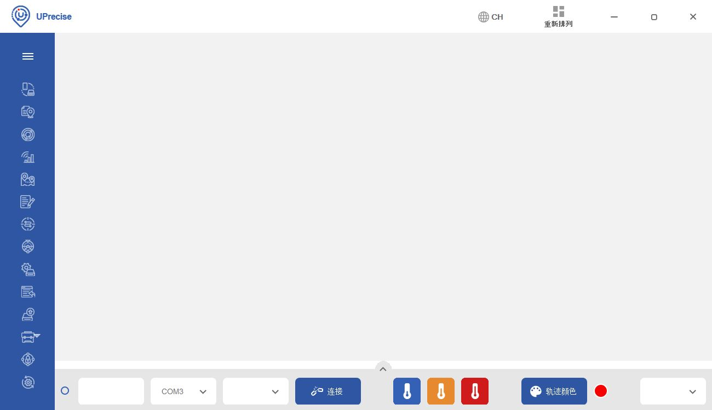
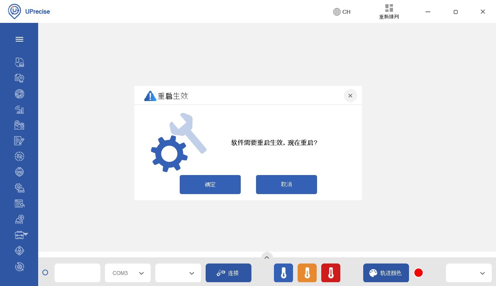
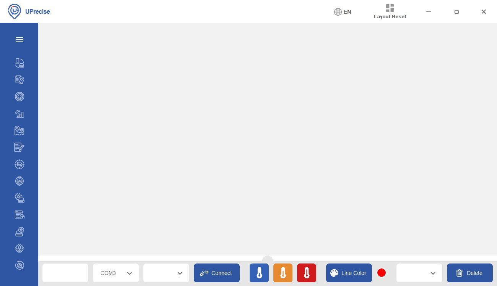
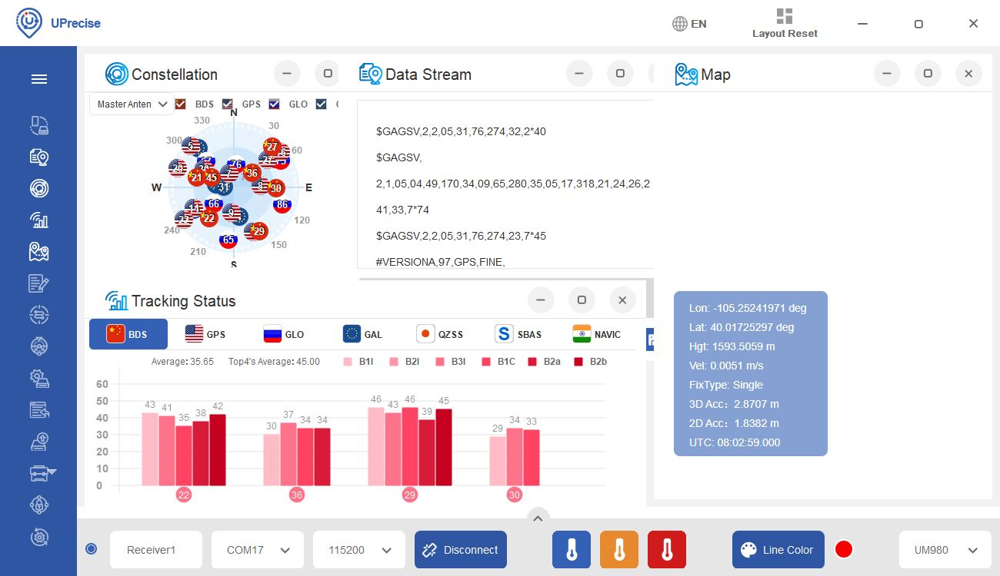

For users interested in a GUI to visualize the data or update firmware, there is the UPrecise Software. You can head over to [Unicore's UPrecise Download Page](https://en.unicore.com/products/uprecise.html). Or clicking on the button below to download UPrecise.

<a href="https://en.unicore.com/uploads/file/Tool/uprecise-v2-0.exe" class="md-button">Click Here to Download UPrecise V2.0 (EXE)</a>

!!! note
    For the latest software version, you may want to check the [Unicore's UPrecise Download Page](https://en.unicore.com/products/uprecise.html).

Once downloaded, select the executable and follow the prompts to install the software to your computer. Note that the software is currently only supported on Windows 7/8/10, 64-bit OS.

### Selecting a Language

After downloading and installing UPrecise, open the software up! There are two languages that are supported with the software. For the scope of this tutorial, we'll be using the software in English. Click on "CH" button to change the default language from Chinese to English.

  <table>
    <tr style="vertical-align:middle;">
     <td style="text-align: center; vertical-align: middle;"></td>
    </tr>
  </table>

For users with UPrecise V2.0, you will be prompted with a new window indicating that you will need reboot the software for the changes to take effect. Select the button on the left to reboot the software.

  <table>
    <tr style="vertical-align:middle;">
     <td style="text-align: center; vertical-align: middle;"></td>
    </tr>
  </table>

The language will switch to English similar to the image below.

  <table>
    <tr style="vertical-align:middle;">
     <td style="text-align: center; vertical-align: middle;"></td>
    </tr>
  </table>

### Connecting the UM980 Breakout Board to a Computer

We will assume that you have a triband multiband antenna connected to the UM980's breakout board and USB cable connected to your computer. Select the COM port that the CH340 enumerated to. There is no need to make a selection in the other two drop down menus by the COM port since the software automatically determines the receiver and baud rate. In this case, it was **COM17**. You may need to [open your device manager to determine which COM port the CH340 enumerated to](https://learn.sparkfun.com/tutorials/how-to-install-ch340-drivers#windows-710).

  <table>
    <tr style="vertical-align:middle;">
     <td style="text-align: center; vertical-align: middle;"></td>
    </tr>
  </table>

Once connected, try exploring the features available on the software as the UM980 sends data to your COM port. You can also check out the UPrecise user manual for more information on the software:

<a href="../assets/component_documentation/uprecise-user-manual-en-r2-0.pdf" class="md-button">UPrecise User Manual R2.0 - English (PDF)</a>

