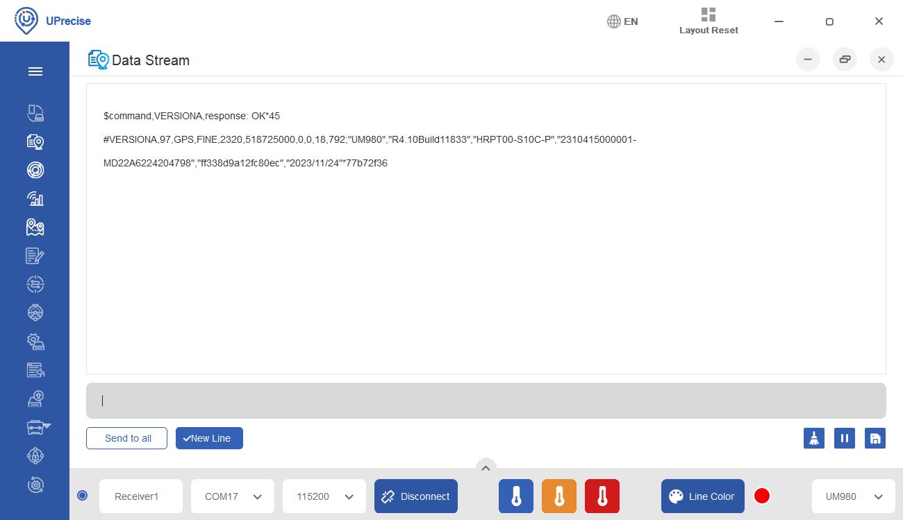
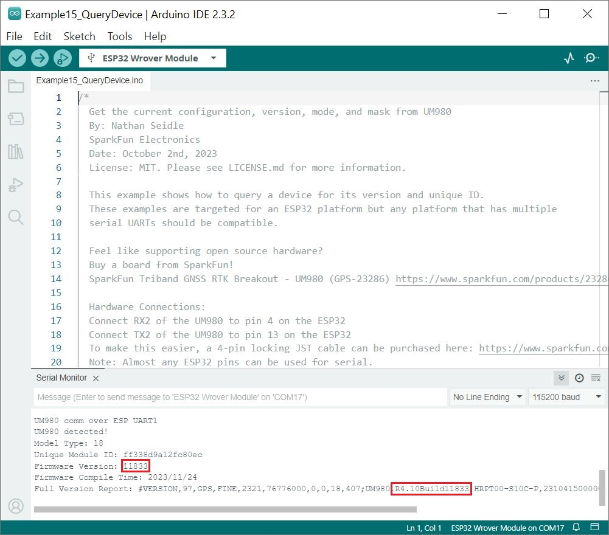
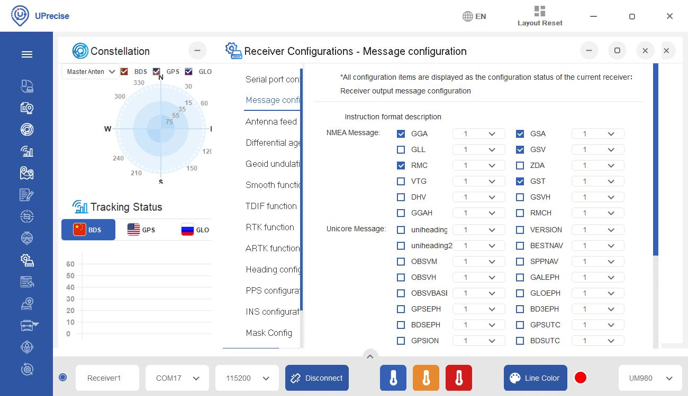
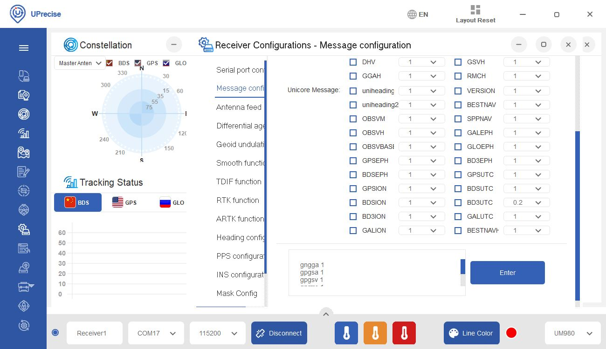
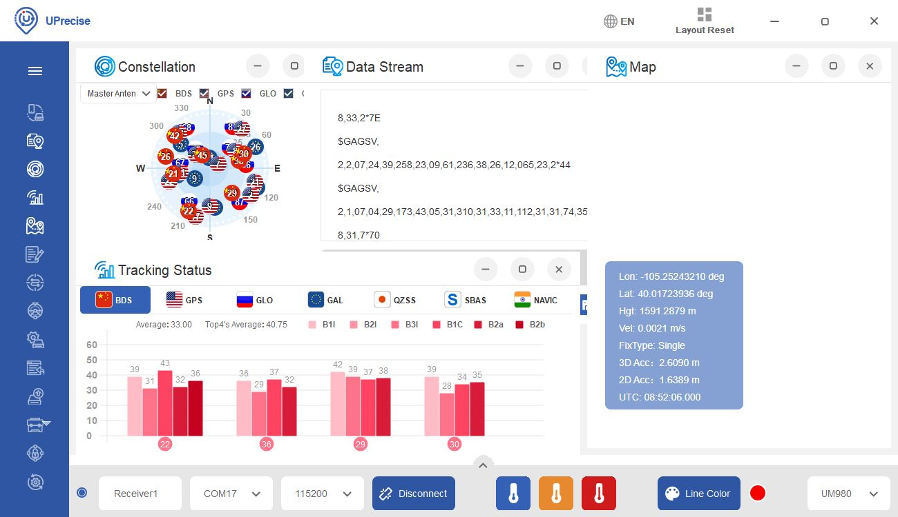

Now that we have successfully flashed the firmware, let's verify the version number. In the serial terminal, send the command `VERSIONA`. The UM980 will respond by providing the firmware version and authorization date. Look for the part of the message after the model number (i.e. "UM980"). This should match the build number from **&#42;pkg** file name.

  <table>
    <tr style="vertical-align:middle;">
     <td style="text-align: center; vertical-align: middle;"></td>
    </tr>
  </table>

!!! note
    Sending the command `VERSIONA` is one method of verifying the version number on the UM980. You can use the [Arduino example code](https://docs.sparkfun.com/SparkFun_UM980_Triband_GNSS_RTK_Breakout/arduino_examples/#example-15-query-device) to verify the version number on the UM980 breakout board.

    

      <table>
        <tr style="vertical-align:middle;">
         <td style="text-align: center; vertical-align: middle;"></td>
        </tr>
      </table>
    

Try viewing the UM980 output through the UPrecise software. Not seeing any satellites in the GUI or output in the serial terminal? Try adjusting the configuration to output every second. From the menu, head to the following to configure the messages: **Receiver Configurations** > **Message configuration**. In this case, we selected the following: **GGA**, **GSA**, **GSV**, **RMC**, **GST**. Feel free to select more depending on your application.

  <table>
    <tr style="vertical-align:middle;">
     <td style="text-align: center; vertical-align: middle;"></td>
    </tr>
  </table>

Scroll down **Receiver Configurations** window and select **Enter** button.

  <table>
    <tr style="vertical-align:middle;">
     <td style="text-align: center; vertical-align: middle;"></td>
    </tr>
  </table>

You should be able to see messages outputting through the serial terminal and displaying graphically.

  <table>
    <tr style="vertical-align:middle;">
     <td style="text-align: center; vertical-align: middle;"></td>
    </tr>
  </table>

